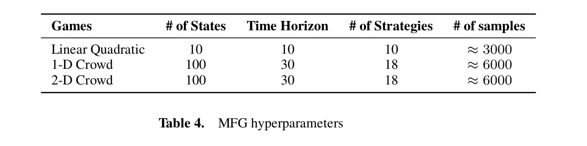

4-25:

2D crowd 里，`状态均值/方差` 这两个特征你希望第一版怎么定义？
用到目标点的距离统计 (Recommended)

文件变化:

6 个文件已更改  +495  -85

open_spiel/games/mfg/EGTA/model_learning/generate_data.py  +4 -2
open_spiel/games/mfg/EGTA/model_learning/sample_utility.py +23 -3
open_spiel/games/mfg/EGTA/model_learning/strategy_feature_extractor.py  +212 -0
open_spiel/games/mfg/EGTA/se_gm/egta_example.py +13 -2
open_spiel/games/mfg/EGTA/se_gm/meta_strategies.py +42 -42
open_spiel/games/mfg/EGTA/se_gm/model.py +201 -36

预设表里的参数：

3 个文件已更改 +72 -1

open_spiel/games/mfg/EGTA/game_presets.py  +62 -0
open_spiel/games/mfg/EGTA/model_learning/generate_data.py +5 -0
open_spiel/games/mfg/EGTA/se_gm/egta_example.py +5 -1

------------------------------------------------------
1plan
# 用 Transformer 策略嵌入替换 One-Hot 的实现方案

## Summary

目标是在现有 `MFG EGTA / game model learning` 框架中，把论文里的 `one-hot(strategy_idx)` 替换为“基于策略时序行为特征的 Transformer embedding”，形成新的 utility 预测模型：

`policy features over time -> Transformer Encoder -> z_i`
`[z_i ; sigma] -> MLP -> utility`

这个方向是正确且可实现的。它直接对应论文指出的 one-hot 缺陷：无法表达策略相似性。新方案通过 30 步 × 6 维的行为指纹，让模型按“策略行为相似”而不是“编号相同”来泛化。

默认实现决策已锁定：
- 同时支持 `1D crowd` 和 `2D crowd`
- 2D 中的“状态均值/方差”改为“到目标点距离的均值/方差”
- 保持每步 6 维、总序列长度 30、embedding 维度 128、再拼接 18 维混合策略得到 146 维输入给 MLP

## Key Changes

### 1. 特征抽取层

新增一个统一的 `strategy feature extractor`，输入为单个 pure strategy 和环境配置，输出固定形状的 `[T, 6]` 特征矩阵。

每个时间步的 6 个特征定义如下：

- `f1 = E[a] = sum_x mu_t(x) sum_a s_t(a|x) * a`
- `f2 = Var(a) = E[a^2] - E[a]^2`
- `f3 = H(A) = - sum_x mu_t(x) sum_a s_t(a|x) log s_t(a|x)`
- `f4 = state_mean`
  - 1D: `sum_x mu_t(x) * x`
  - 2D: `sum_x mu_t(x) * d(x, goal)`，其中 `d` 为到目标/奖励中心的距离
- `f5 = state_var`
  - 1D: `sum_x mu_t(x) * (x - E[x])^2`
  - 2D: `sum_x mu_t(x) * (d(x, goal) - E[d])^2`
- `f6 = t / T`

特征生成流程固定为：
1. 初始人群分布设为环境默认初始分布；若环境未自定义，则用均匀分布。
2. 对每个 pure strategy 单独模拟 forward evolution，共 30 步。
3. 每步先用当前 `mu_t` 和该策略的 `s_t` 计算 6 个统计值。
4. 再用当前策略和环境转移推进到下一步 `mu_{t+1}`。
5. 最终得到该 pure strategy 的 `[30, 6]` 表示。

实现上不改动环境本身，复用现有 distribution / policy 接口；不要手写新的环境模拟器，避免和 OpenSpiel 状态转移逻辑分叉。

### 2. 模型结构替换

把当前的 `one-hot + sigma -> MLP` 改成两段式模型：

- `Transformer encoder`
  - 输入 `[30, 6]`
  - 线性投影 `6 -> 128`
  - 加位置编码
  - 若干层 encoder block
  - 序列池化得到 `z_i in R^128`
- `Utility head`
  - 输入 `[z_i ; sigma] in R^(128 + num_policies)`
  - 其中当前目标实验默认 `num_policies = 18`
  - 输出标量 utility

接口保持与现有 utility regressor 一致：
- 训练时输入 `(strategy_features, mixed_weights)`
- 推理时给定 `policy_idx`，先查表取该 pure strategy 的预计算 embedding 或原始 `[30,6]`，再与当前 mixed weights 拼接预测 utility

第一版默认策略 embedding 预计算并缓存，不在每次 `predict` 时重复跑特征抽取。

### 3. 数据生成与训练管线

在现有 `sample_utility.py` / `generate_data.py` 的 coarse data 流程上扩展，不推翻 EGTA 采样逻辑。

训练样本改为：
- 输入 1: pure strategy 的 `[30, 6]` 特征矩阵
- 输入 2: sampled mixed strategy `sigma`
- 标签: 真实 utility `u(s, mu_sigma)`

数据生成仍沿用当前做法：
- 先跑 EGTA 得到 restricted policy set
- 用 grid + Dirichlet 在 simplex 上采样 mixed strategy
- 对每个 `sigma` 诱导 distribution，并计算每个 pure strategy 的真实 utility

变化点只在“pure strategy 表示”：
- 旧版: one-hot(policy_idx)
- 新版: transformer-ready feature matrix 或其 embedding

第一版保留旧 one-hot 基线，不删除旧路径。训练脚本增加显式开关，例如：
- `encoding = one_hot | transformer_stats`

### 4. 与当前内层求解的对接

在 `se_gm/meta_strategies.py` 中，`predict(policy_idx)` 的输入构造逻辑改成：
- 从缓存中取 `policy_idx` 对应的 strategy embedding `z_i`
- 读取当前 mixed weights `sigma`
- 拼接后送入 utility head

不要让 inner loop 在运行时重新模拟 30 步特征；特征和 embedding 都应在 restricted strategy set 固定后一次性生成。

RD / FP 的现有逻辑保持不变，只替换 utility evaluator 的输入编码方式。这样可以直接与现有 one-hot 模型对比 regret / NashConv。

## Test Plan

必须覆盖以下验证：

- 特征抽取正确性
  - 1D toy case 手算校验 `E[a] / Var(a] / H(A) / E[x] / Var(x] / t/T`
  - 2D toy case 校验“到目标距离的均值/方差”
  - 检查输出形状恒为 `[30, 6]`

- 数据与接口一致性
  - 单个 pure strategy 能稳定生成一份特征矩阵
  - 全部 18 个策略能批量生成并缓存
  - mixed strategy 维度与策略池大小一致，拼接后维度正确为 `146`

- 模型前向与训练
  - Transformer encoder 输出固定 `128` 维 embedding
  - utility head 输出标量
  - 训练脚本能在 transformer_stats 模式下跑通完整数据集

- 效果对比
  - 与 one-hot 基线比较测试集 `R^2`
  - 在 FP / RD 内层比较 regret 曲线
  - 至少检查一个 crowd 环境上的 NashConv 或等价求解指标没有明显退化

## Assumptions

- 目标实验默认 restricted policy set 大小为 18；如果未来策略数变化，`sigma` 维度随之自适应，MLP 输入维度改为 `128 + num_policies`
- 时间长度默认按当前 crowd 实验取 `T = 30`
- 2D 的状态统计采用“到目标/奖励中心的距离”而不是分别统计 `x/y`，以保持总特征数固定为 6
- 特征中的动作值按环境真实动作语义映射计算；若 2D 动作集合不是标量，需先映射为“朝目标方向的 signed progress”或等价标量动作编码，但这一步必须与具体 2D action 定义保持一致
- 第一版目标是替换策略表示，不改 EGTA、采样策略、utility 标签定义，也不改环境 reward / transition
  

------------------------------------------------------